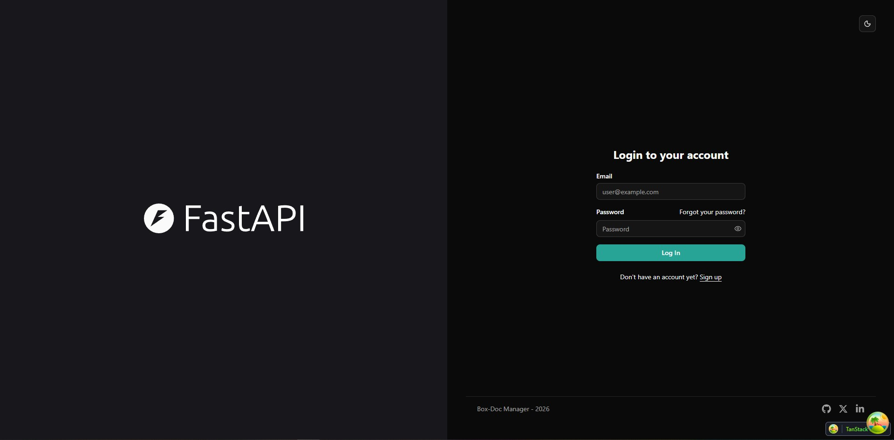
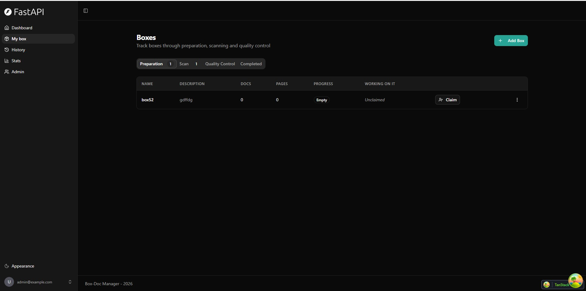
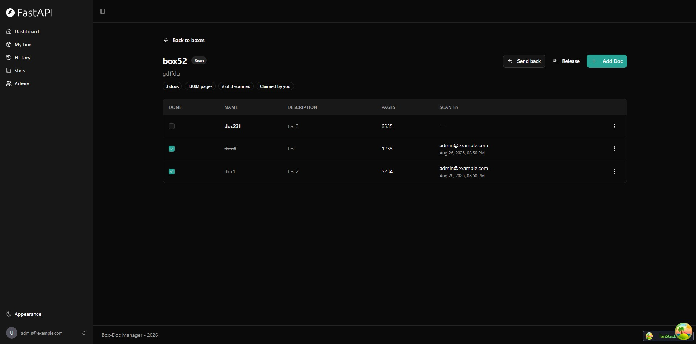
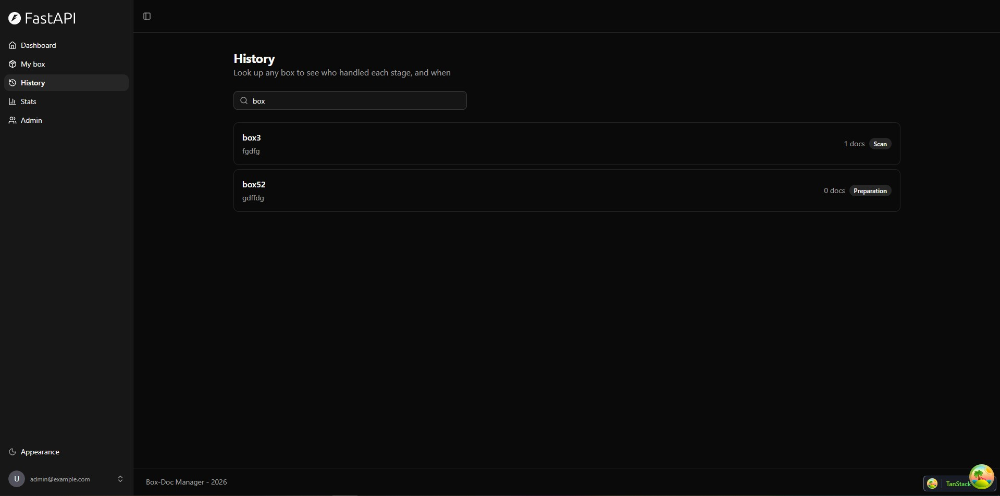
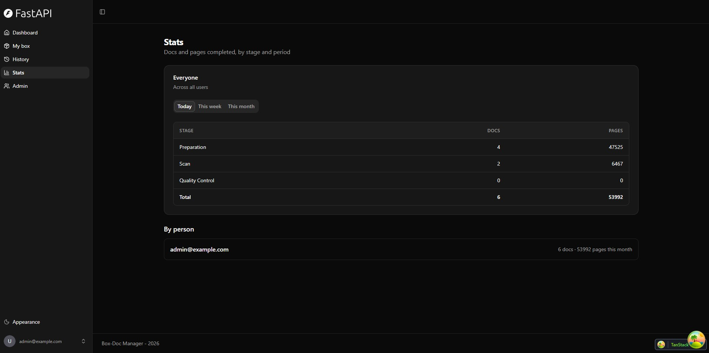
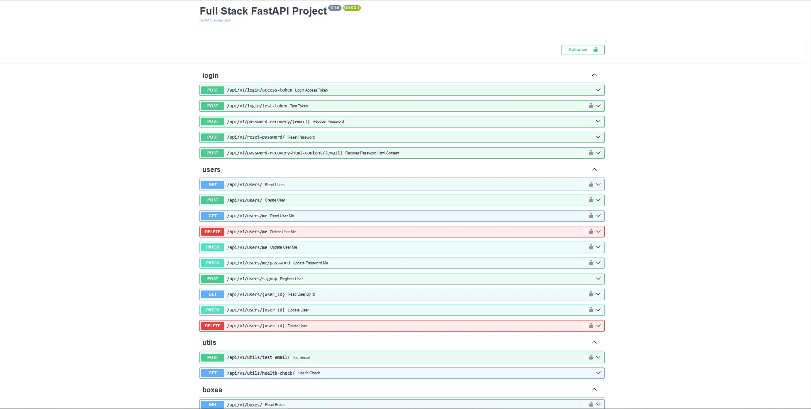
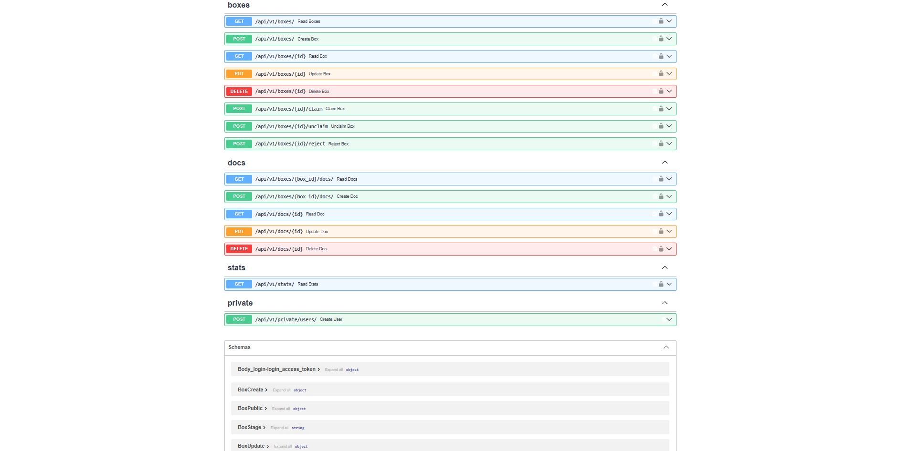

# Box-Doc Manager

An app for tracking the digitisation of paper archives. Boxes of documents get
registered in the system, and each box moves through three stages: preparation,
scan, and quality control. The app keeps track of who did what and when.

This is my final project for the AUEB Coding Factory programme. It is built on
top of the [Full Stack FastAPI Template](https://github.com/fastapi/full-stack-fastapi-template).

## Technology Stack and Features

- ⚡ [**FastAPI**](https://fastapi.tiangolo.com) for the Python backend API.
  - 🧰 [SQLModel](https://sqlmodel.tiangolo.com) for the Python SQL database interactions (ORM).
  - 🔍 [Pydantic](https://docs.pydantic.dev), used by FastAPI, for the data validation and settings management.
  - 💾 [PostgreSQL](https://www.postgresql.org) as the SQL database.
  - 🏗️ Layered architecture with Controllers, Services and Repositories.
- 🚀 [React](https://react.dev) for the frontend.
  - 🧩 Built into the backend image and served by FastAPI on the same domain as the API.
  - 💃 Using TypeScript, hooks, [Vite](https://vitejs.dev), and other parts of a modern frontend stack.
  - 🎨 [Tailwind CSS](https://tailwindcss.com) and [shadcn/ui](https://ui.shadcn.com) for the frontend components.
  - 🤖 An automatically generated frontend client.
  - 🧪 [Playwright](https://playwright.dev) for End-to-End testing.
  - 🦇 Dark mode support.
- 🐋 [Docker Compose](https://www.docker.com) for development and production.
- 🔒 Secure password hashing by default.
- 🔑 JWT (JSON Web Token) authentication.
- 📫 Email based password recovery.
- 📬 [Mailcatcher](https://mailcatcher.me) for local email testing during development.
- ✅ 232 tests with [Pytest](https://pytest.org), 95% backend coverage.
- 📖 Swagger UI for the API documentation.
- 📞 [Traefik](https://traefik.io) as a reverse proxy / load balancer.
- 🚢 Deployment instructions using Docker Compose, including how to set up Traefik to handle automatic HTTPS certificates.
- 🏭 CI (continuous integration) and CD (continuous deployment) based on GitHub Actions.

### Login

[](https://github.com/tomgatz96/fastapi-template-project)

### Boxes

Boxes grouped by stage, with the progress of each one and who is working on it.

[](https://github.com/tomgatz96/fastapi-template-project)

### Box Documents

The docs inside a box. The checkbox marks a doc as done for the current stage,
and the column on the right shows who did it and when.

[](https://github.com/tomgatz96/fastapi-template-project)

### History

Search for any box and see which stage it is in.

[](https://github.com/tomgatz96/fastapi-template-project)

### Stats

Docs and pages completed today, this week and this month, per stage and per person.

[](https://github.com/tomgatz96/fastapi-template-project)

## What The App Does

A digitisation department gets boxes of paper documents. Every box has to be
prepared, then scanned, then checked for quality before it is finished. Many
people work at the same time, so the app has to show what state each box is in
and how much work each person has done.

Here is how it works:

- A user creates a **box** and adds the **docs** that are inside it.
- The box starts in the `preparation` stage.
- A user **claims** the box to work on it. You can only hold one box at a time.
- The user marks each doc as done for the current stage.
- When all the docs are done, the box moves to the next stage automatically.
- In quality control, a box can be **rejected**, which sends it back one stage.
- When quality control is finished, the box is `completed`.

Every time a doc is marked as done, the app saves the user and the timestamp.
The stats page uses this to show how many docs and pages each person finished
today, this week and this month.

## Domain Model

There are three tables.

**User** — an account. A user owns the boxes they create and can claim one box
at a time.

**Box** — a container of documents. It has a name, an owner, a stage, and an
assignee (the user who claimed it). Box names are unique, ignoring case.

**Doc** — a document inside a box. It has a name and a number of pages, plus
three pairs of columns that record the pipeline work:

| Stage | Columns |
|---|---|
| `preparation` | `prepared_at`, `prepared_by_id` |
| `scan` | `scanned_at`, `scanned_by_id` |
| `quality_control` | `checked_at`, `checked_by_id` |

The stages are `preparation` → `scan` → `quality_control` → `completed`.

The tables are defined as SQLModel classes in `backend/app/models.py`, and the
database is created from them with Alembic migrations. There is no SQL written
by hand.

## Architecture

The backend is split into three layers:

```
Request → Controller → Service → Repository → Database
```

- **Controllers** (`backend/app/api/routes/`) — bind the URL, take the input and
  call one service method. No business rules and no SQL.
- **Services** (`backend/app/services/`) — the business rules. Who is allowed to
  do what, and what happens when they do. They raise domain exceptions like
  `NotFoundError` instead of HTTP errors.
- **Repositories** (`backend/app/repositories/`) — all the database queries.

`backend/app/api/errors.py` turns the domain exceptions into HTTP status codes,
so the services do not need to know anything about HTTP.

There is also `backend/app/services/pipeline.py`, which holds the stage rules as
plain functions with no database and no HTTP. This makes them easy to test.

## Interactive API Documentation

Once the app is running, the Swagger UI is at:

**http://localhost:8000/docs**

ReDoc is at `/redoc` and the raw OpenAPI schema is at `/api/v1/openapi.json`.

To call an endpoint that needs a login, click **Authorize** and sign in with the
superuser from your `.env` file.

[](https://github.com/tomgatz96/fastapi-template-project)

The boxes, docs and stats endpoints, and the schemas generated from the models:

[](https://github.com/tomgatz96/fastapi-template-project)

### Main Endpoints

All endpoints start with `/api/v1`.

| Method | Path | What it does |
|---|---|---|
| `POST` | `/login/access-token` | Log in and get a token |
| `POST` | `/users/signup` | Register a new user |
| `GET` | `/users/me` | Get the current user |
| `GET` | `/boxes/` | List boxes |
| `POST` | `/boxes/` | Create a box |
| `POST` | `/boxes/{id}/claim` | Claim a box |
| `POST` | `/boxes/{id}/unclaim` | Release a box |
| `POST` | `/boxes/{id}/reject` | Send a box back one stage |
| `GET` | `/boxes/{box_id}/docs/` | List the docs in a box |
| `POST` | `/boxes/{box_id}/docs/` | Add a doc to a box |
| `PUT` | `/docs/{id}` | Update a doc or mark it done |
| `GET` | `/stats/` | Work totals per stage and per user |

The full list is in the Swagger UI.

## How To Use It

Clone the repository and go into the folder:

```bash
git clone https://github.com/tomgatz96/fastapi-template-project.git
cd fastapi-template-project
```

### Configure

Copy the example environment file:

```bash
cp .env.example .env
```

Then update the configs in the `.env` file to customize your configurations.

Before running it, make sure you change at least the values for:

- `SECRET_KEY`
- `FIRST_SUPERUSER_PASSWORD`
- `POSTGRES_PASSWORD`

Read the [deployment.md](./deployment.md) docs for more details.

### Generate Secret Keys

Some environment variables in the `.env` file have a default value of `changethis`.

You have to change them with a secret key, to generate secret keys you can run the following command:

```bash
python -c "import secrets; print(secrets.token_urlsafe(32))"
```

Copy the content and use that as password / secret key. And run that again to generate another secure key.

### Run It With Docker

```bash
docker compose up -d
```

That is all. The database migrations run automatically before the backend
starts, and the first superuser is created from the `FIRST_SUPERUSER` and
`FIRST_SUPERUSER_PASSWORD` values in `.env`.

Now you can open:

| URL | What it is |
|---|---|
| http://localhost:8000 | The app |
| http://localhost:8000/docs | Swagger UI |
| http://localhost:8080 | Adminer, to look at the database |
| http://localhost:1080 | Mailcatcher, to read the emails the app sends |

There is no separate frontend container. The React app is built into the
backend image and served by FastAPI, so the UI and the API are on the same port.

To stop it:

```bash
docker compose down       # stop it
docker compose down -v    # stop it and delete the database
```

### Run It Locally

You can also run the backend and frontend outside Docker, which reloads faster
while you are developing. You need [uv](https://docs.astral.sh/uv/) and
[bun](https://bun.sh/) installed.

Start only the database:

```bash
docker compose up -d db mailcatcher
```

Make sure `POSTGRES_SERVER=localhost` in your `.env`. Inside Docker the
containers find the database as `db`, but from your own machine it is
`localhost`.

Then the backend:

```bash
cd backend
uv sync
uv run alembic upgrade head
uv run fastapi dev app/main.py
```

And the frontend in another terminal:

```bash
cd frontend
bun install
bun run dev
```

The frontend dev server runs on http://localhost:5173 and talks to the backend
on port 8000.

## Tests

There are 232 tests and the backend coverage is 95%.

| Folder | What it tests | Needs a database |
|---|---|---|
| `backend/tests/services/` | Business rules, using fake repositories | No |
| `backend/tests/repositories/` | Saving and loading users | Yes |
| `backend/tests/api/routes/` | All the endpoints over HTTP | Yes |
| `backend/tests/scripts/` | Startup checks | Yes |

Run everything in Docker:

```bash
bash scripts/test.sh
```

Or run them locally, which is faster:

```bash
docker compose up -d db mailcatcher
cd backend
uv run alembic upgrade head
uv run pytest -q
```

To run only the tests that do not need a database:

```bash
cd backend
uv run pytest tests/services -q
```

To get a coverage report:

```bash
cd backend
uv run coverage run -m pytest tests/
uv run coverage report
uv run coverage html
```

### End-to-End Tests

```bash
docker compose up -d --wait backend
cd frontend
bunx playwright test
```

## Database Migrations

The migrations are in `backend/app/alembic/versions/`.

Apply them:

```bash
cd backend
uv run alembic upgrade head
```

If you change `backend/app/models.py`, create a new migration:

```bash
uv run alembic revision --autogenerate -m "what you changed"
uv run alembic upgrade head
```

Always read the generated file before you run it. Alembic does not detect
everything, for example the case-insensitive unique indexes on box and doc
names had to be added by hand.

## Backend Development

Backend docs: [backend/README.md](./backend/README.md).

## Frontend Development

Frontend docs: [frontend/README.md](./frontend/README.md).

## Deployment

Deployment docs: [deployment.md](./deployment.md).

In short, on the server you set `ENVIRONMENT=production`, `DOMAIN`, and real
values for `SECRET_KEY`, `POSTGRES_PASSWORD` and `FIRST_SUPERUSER_PASSWORD`, then:

```bash
docker compose -f compose.yml build
docker compose -f compose.yml up -d
```

The `-f compose.yml` matters, because it leaves out `compose.override.yml`,
which has development-only settings in it. Traefik handles the HTTPS
certificates.

## Development

General development docs: [development.md](./development.md).

This includes using Docker Compose, custom local domains, `.env` configurations, etc.

## Troubleshooting

**`password authentication failed for user "postgres"`**

Something else is already using port 5432, usually a PostgreSQL installed
directly on your machine. Check what has the port:

```bash
# Windows PowerShell
Get-Process -Id (Get-NetTCPConnection -LocalPort 5432 -State Listen).OwningProcess

# macOS / Linux
lsof -i :5432
```

If it is a local PostgreSQL, stop it. On Windows that is
`Stop-Service postgresql-x64-18` in an Administrator PowerShell.

**`RuntimeError: Frontend directory ... does not exist`**

The backend serves the built frontend from `backend/app/frontend`, which is not
in git. If you run the backend locally without building the frontend, make a
placeholder:

```bash
mkdir -p backend/app/frontend && echo "<html></html>" > backend/app/frontend/index.html
```

**Docker says `open //./pipe/dockerDesktopLinuxEngine`**

Docker Desktop is not running. Start it and wait for it to finish loading.

## License

The Full Stack FastAPI Template is licensed under the terms of the MIT license.
